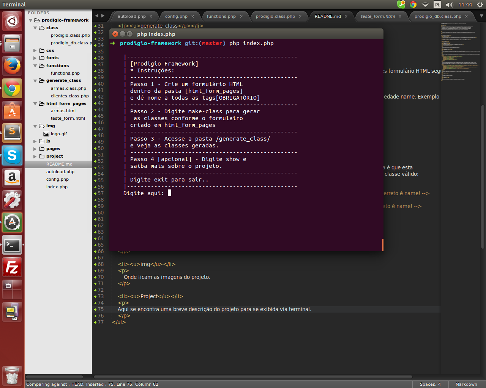
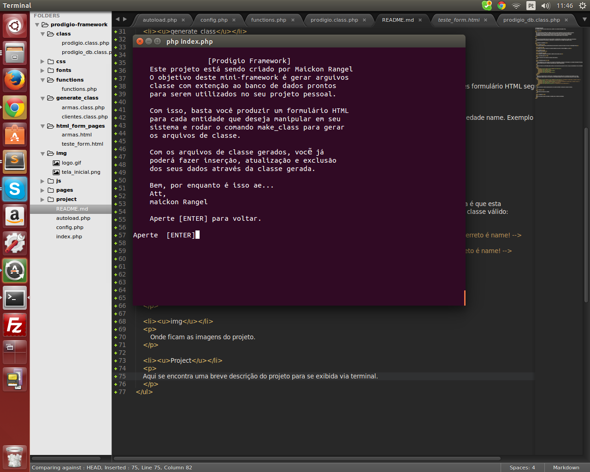
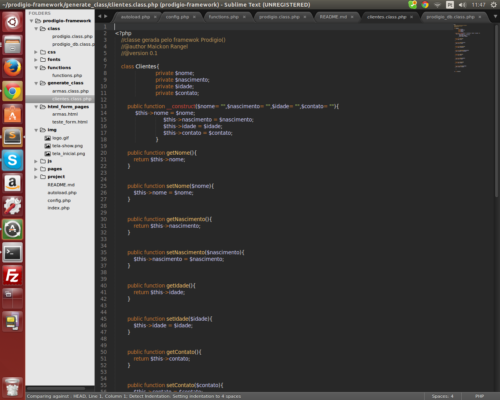

# Prodigio-Framework
Um mini-framework que produz classes php a partir de uma simples formulário HTML.

<h3>Sobre</h3>

    Este mini framework foi feito para agilizar o processo de desenvolvimento de quem não gosta de escrever
    seus arquivos de classe na mão. Com este pequeno fremewok basta você produzir sues arquivos de
    formulário HTML no diretório /html_form_pages/ e rodar o comando make-class. Pronto! uma classe
    no /diretório generate_class/ será criada com base no formulário HTML que você escreveu.

    Por enquanto este projeto está sendo desenvolvido no ambiente linux, dessa forma não estou dando importância
    a posíveis problemas por questão de ambientação. É desejável que você utilize este projeto no linux.

<h3>Estrutura dos diretórios</h3>
<ul>
    <li><u>Class</u></li>
    
Aqui se encontra a classe principal responsável por gerar os arquivos de classe com base no formulário HTML.

    <li><u>css</u></li>
    
Arquivos css como de costume em qualquer projeto web. Ainda não foram utilizados... rsrs

    <li><u>Fonts</u></li>
    
Arquivos para fontes.

    <li><u>functions</u></li>
    
As funções de utilidade geral dentro do sistema serão postas aqui.

    <li><u>generate_class</u></li>
    

        Aqui é o local onde seus arquivos de classe serão gerados.
    

    <li><u>html_form_pages</u></li>
    

        É neste diretório que vocẽ vai cria os seus arquivos de formulário, um arquivo de formulário é um simples formulário HTML seguindo
        uma convenção para que o comando make-class gere a classe corretamente.
    

    

        Quando for criar o seu formulário, fique ciente que cada tag deverá possuir um nome ou seja, uma propriedade name. Exemplo de um formulário válido:
    

    <code>
        <form class="usuario" name="usuario" method="post" id="form">
            <imput type="text" name="nome">
            <imput type="text" id="teste" name="email">
            <imput type="text" name="login">
            <imput type="text" id="teste" name="senha">
        </form>
    </code>
    

        Observe que independente da orderm onde a propriedade [name] esteja, isso não importa. O que importa é que esta
        propriedade esteja lá. Agora um exemplo de um formulário inválido onde não irá produzir um arquivo de classe válido:
    

    <code>
        <form class="usuario" names="usuario" method="post" id="form"><!-- propriedade escrita errada, o cerreto é name! -->
            <imput type="text" > <!-- a propriedade name não se encontra aqui -->
            <imput type="text" id="teste" mame="email"> <!-- novamente, a propriedade escrita errada, o cerreto é name! -->
            <imput type="text" name "login"> <!-- falta o sinal de igual -->
            <imput type="text" id="teste name=senha"> <!-- falta fechar a aspa corretamente! -->
        </form>
    </code>
    

        Todos este erros e outros possíveis podem e vão gerar uma falha na produção do arquivo de classe.
    

    <li><u>img</u></li>
    

        Onde ficam as imagens do projeto.
    

    <li><u>Project</u></li>
    

        Aqui se encontra uma breve descrição do projeto para se exibida via terminal.
    

    <li><u>Como utilizar</u></li>
    

        A tela inicial exibe o menu. Quando baixado o projeto você deve estar dentro do diretório pelo terminal. Quando estiver dentro do projeto
        execute o comando  php index.php para dar início a tela principal conforme a imagem abaixo.
    

    
    

       Com o comando show conforme dito antes você terá acessoa uma breve descrição do projeto via terminal. Execute: show
    

    
    

        Com o comando make-class vocẽ vai gerar uma classe no diretório /generate_class/ para cada formulário válido dentro
        do diretório /html_form_pages/ .
    

    
    

        Uma vez executado o comando make-class você terá a sua disposição os arquivos de classe conforme o seu formulário.
    

    

    

        Bem... é isso, em breve novas atualizações.
        Att,
        Maickon Rangel
    

</ul>